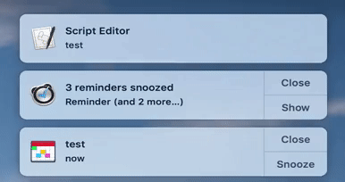
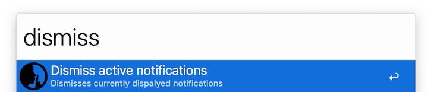

# Notification Dismisser
>*Ever opened your Mac, just to have a million notifications pop up in you face and didn't feel like manually closing all of them? Or didn't feel like lifting your fingers from the keyboard (and wasting precious seconds!) just to dismiss a random notification from your boss?*
\
\
*Then you've come to the right place!*
 

## About
Simple Alfred workflow to dismiss all active (currently visible) notifications.
- **Without using the mouse**, either by pressing a shortcut or typing a keyword into Alfred.
- **No external dependencies**, just a bit of AppleScript.

## Demo

### Brief Explanation:
1. Shortcut is pressed.
2. Banner notifications are dismissed. In this example, the "Script Editor" notification.
3. Alert notifications are dismissed one-by-one.
4. Relax and enjoy your precious saved seconds 😌.
 

## Installing
1. Click this [download](https://github.com/zakyum/alfred-notification-dismisser/releases/download/v1.0.0/alfred-notification-dismisser.alfredworkflow) button or navigate to this project's releases page.
2. Double-click the downloaded workflow and import into Alfred.
3. Open the workflow and set a keyboard shortcut. [optional]

## Usage
Launch the workflow by pressing the keyboard shortcut or by typing "dismiss" into Alfred.

## Specifics
- All the work is done via the AppleScript, the Alfred workflow only runs the script.
- Dismisses only the active/visible notifications on the screen, doesn't touch the notifications in notification center.
- Dismisses alert notifications only if they have a close button, otherwise displays error.
- Detects stuck notifications and displays error, but if there are currently more than 20 notifications will cause a false positive (reason why documented in code).

## FAQ
- **Q:** How are banner notifications dismissed if they don't have any buttons?\
**A:** Banner notifications are cleared on notification center restart, so we "dismiss" them by restarting notification center. As far as I know, there is no way to dismiss banner notifications via GUI (AppleScript).

- **Q:** Why are alert notifications closed one by one?\
**A:** Alert notifications persist notification center restarts and, as far as I know, there isn't a way to batch close them, so we do it via GUI one by one.

## License
[MIT License](./LICENSE.txt)
